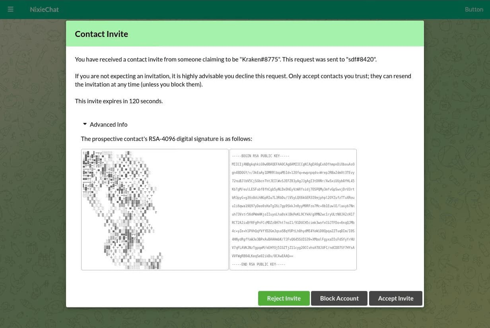
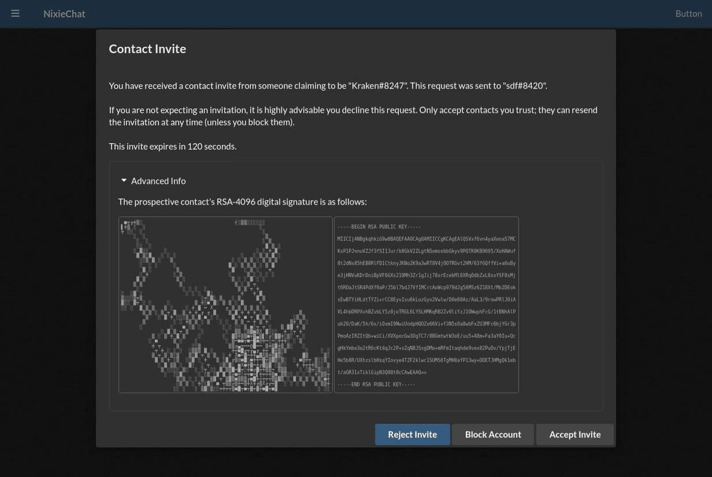
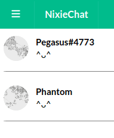

# Frostoven NixieChat

NixieChat is a chat stack that uses end-to-end encryption for communication. It
uses Diffie-Hellman to add contacts, and AES-256 (in GCM) mode to encrypt
messages, accounts, and contact information. It signs messages with RSA.
NixieChat servers act only as connection forwarders, and cannot read your
messages. This project will serve as a base for web, mobile, and desktop
applications.

## Do not use this yet

This app is still under development. It isn't fully formed yet, and still has
a weeks until its usable. It will break a lot during that time.

## Cryptography Notice

This distribution includes cryptographic software. The country in which you
currently reside may have restrictions on the import, possession, use, and/or
re-export to another country, of encryption software. BEFORE using any
encryption software, please check your country's laws, regulations and policies
concerning the import, possession, or use, and re-export of encryption
software, to see if this is permitted.

## Screenshots

Adding contacts:

Profile pics generate from RSA keys:

## Developer notes

For build instructions see [BUILD_INSTRUCTIONS.md](BUILD_INSTRUCTIONS.md).
